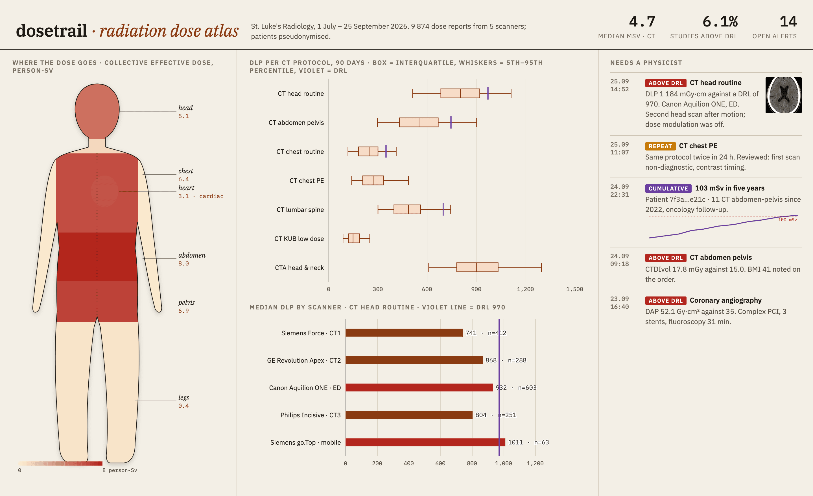

# dosetrail

A radiation dose registry for a radiology department, fed straight by the scanners.

CT scanners, angiography suites and DR rooms already write a **Radiation Dose Structured Report** (RDSR) after every exam. Most departments send it to the PACS and never read it. dosetrail is a DICOM node you add as one more destination: it reads each report, keeps the dose per exam and per irradiation event, follows each patient's cumulative dose under a pseudonym, and flags what a medical physicist should look at.



## What it flags

- **Above a diagnostic reference level** — CTDIvol or DLP for CT, DAP for fluoroscopy, against the levels in `drl.yaml`. A DRL is not a limit; the alert asks for a reason, which is recorded when the alert is closed.
- **Cumulative dose** — 100 mSv effective dose within five years for one patient.
- **Repeat scans** — the same protocol on the same patient within 24 hours.

Alerts can be posted to a webhook (Teams, Slack, a ticketing system) as they happen.

## What it shows

- DLP distribution per CT protocol as box plots, with the DRL drawn across. Protocols whose median sits near the line are the first place to optimise.
- The same protocol on different scanners, side by side.
- A pseudonymous patient's history with the running five-year effective dose.

## Setup

```sh
docker compose up -d
# on the scanner or the PACS: add a DICOM destination
#   AE title DOSETRAIL, host <this machine>, port 11112, send SR dose reports only
cd web && npm install && npm run dev
```